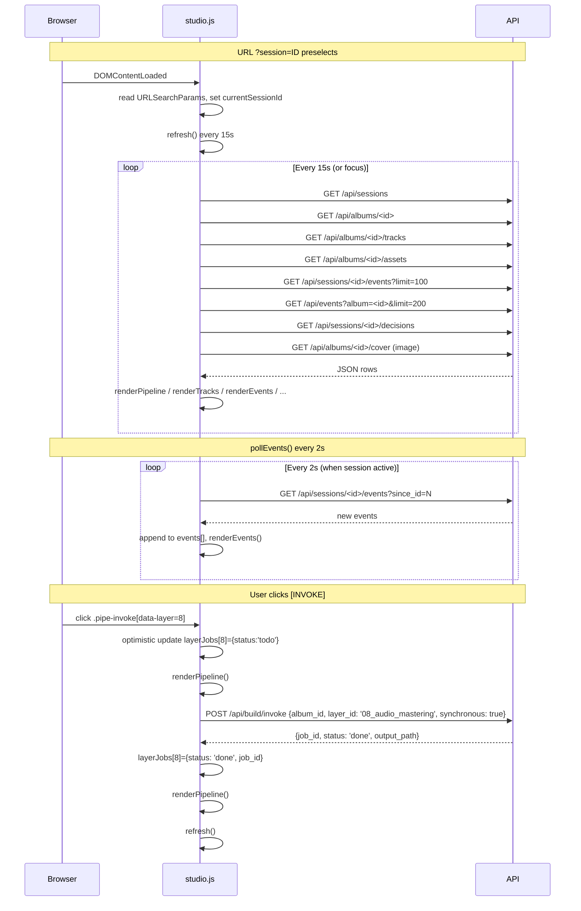

# album-studio · Technical Implementation Reference

> The complete architecture of album-studio v3.4 (Mixtape '85 era),
> from the database schema through the HTTP layer to the frontend
> studio. This is the developer-facing companion to the [User Manual](USER_MANUAL.md).

**Last updated:** 2026-09-02 (Days 6-12 of plan v3.4)

---

## 1. Architecture overview

```
┌──────────────────────────────────────────────────────────────────┐
│                    album-studio v3.4 daemon                         │
│                                                                     │
│  ┌─────────┐  ┌──────────┐  ┌──────────┐  ┌──────────┐  ┌─────────┐ │
│  │ db layer│  │ handlers │  │  runner  │  │ sweepers │  │ static  │ │
│  │ SQLite  │←→|  Quart   │←→| build    │←→| 5       │←→| site/   │ │
│  │ WAL     │  │ blueprints│  | runner  │  | daemon   │  | files   │ │
│  └─────────┘  └──────────┘  └──────────┘  └──────────┘  └─────────┘ │
│       ↑              ↑                            ↑                │
│       │              │                            │                │
│   albums.db     /api/*                     .meta/daemon.log    OneDrive│
│                                                ↑               canonical│
└──────────────────────────────────────────────────────────────────┘
                                            │
                                            └─ runs every 5min-1h
                                                (idle_pause, wal_checkpoint,
                                                 quota, mirror, log_rotate)
```

### 1.1 Process model

Single daemon process per album-studio project. Bound to `127.0.0.1:8765` by default. Background threads:

- **5 sweeper threads** (idle_pause / wal_checkpoint / quota / mirror / log_rotate)
- **HTTP server** (Hypercorn + Quart)
- **Singleton lock** at `.meta/daemon.lock` — only one daemon per project

---

## 2. Database layer (`db/`)

### 2.1 Tables (15 total)

| Table | Purpose | Key columns |
|---|---|---|
| `artists` | Musical artists | `id` (slug), `name`, `persona`, `formed_year` |
| `albums` | Album records | `id`, `title`, `primary_artist_id`, `status`, `cover_path`, `runtime_min`, `isrc`, `m09_sonic_dna` |
| `tracks` | Per-album tracks | `id` (`<album>:<num>`), `album_id`, `track_num`, `title`, `duration_sec`, `mp3_path` |
| `assets` | Cover art, posters, lyrics, etc. | `id`, `album_id`, `kind`, `path`, `mime`, `width`, `height`, `size_bytes`, `sha256` |
| `album_sessions` | Build sessions per album | `id` (UUID), `album_id`, `status`, `last_activity_at`, `closed_at` |
| `events` | Chat / build / quota / system events | `id`, `session_id` (nullable), `album_id`, `role`, `kind`, `payload_json` |
| `decisions` | Locked concept-brief answers | `id`, `album_id`, `code` (M01-M09, R09-R14, E15-E21), `tier`, `answer`, `locked_at` |
| `build_jobs` | Build runner jobs | `id`, `album_id`, `layer_id` (01-12), `status`, `output_path`, `elapsed_sec`, `exit_code` |
| `album_briefs` | Locked concept brief JSON | `album_id`, `brief_json`, `locked_decisions_json`, `sonic_dna_json` |
| `lyrics` | Per-track lyrics (md + lrc) | `track_id`, `format`, `content`, `checksum` |
| `quota_snapshots` | mmx quota history | `model_kind`, `interval_pct`, `interval_remaining_ms`, `raw_json` |

### 2.2 Connection pool

`db/connection.py` provides a **per-thread** SQLite connection cache. Each thread gets one cached connection. Critical pattern:

```python
from db.connection import open_db, close_db
conn = open_db()  # cached per-thread
try:
    cur = conn.execute(...)
    conn.commit()  # WAL mode, busy_timeout=5000ms
finally:
    close_db()  # pops from cache (not just closes)
```

The cache MUST be cleared between tests (`close_all()` in `setUp`/`asyncSetUp`) to avoid `database is locked` race conditions.

### 2.3 Migrations

`db/migrations/` directory with sequentially numbered SQL files:

```
001_initial_schema.sql      (initial 12 tables, FKs, indexes)
002_build_jobs_runner_columns.sql  (output_path, elapsed_sec, exit_code)
003_events_session_nullable.sql    (nullable session_id for global build events)
```

Migrations are auto-applied at daemon startup via `db/migrations.run_migrations()`. `001` is generated from `db/schema.sql` on first run (the "bootstrap").

---

## 3. HTTP layer (`build/`)

### 3.1 Blueprints

| Blueprint | Module | Routes |
|---|---|---|
| `albums_bp` | `handlers_albums.py` | `/api/albums*` (CRUD + finalize + reopen + archive + drilldowns) |
| `sessions_bp` | `handlers_sessions.py` | `/api/sessions*` (CRUD + lifecycle + drilldowns) |
| `events_bp` | `handlers_events.py` | `/api/events` (list with `?session=` or `?album=`, create) |
| `decisions_bp` | `handlers_decisions.py` | `/api/decisions*` (CRUD with PATCH semantics) |
| `build_bp` | `handlers_build.py` | `/api/build/*` (invoke + jobs + cancel) |
| `intake_bp` | `handlers_intake.py` | `/api/intake/submit` + `/api/intake/brief*` |

### 3.2 Static handlers (in `build/serve.py:create_app`)

| Route | Handler | Notes |
|---|---|---|
| `/site/<path>` | `site_static` | `send_file` from `PROJ_ROOT/site/`. 403 on path traversal. |
| `/assets/<path>` | `assets_static` | `send_file` from `PROJ_ROOT/assets/`. |
| `/api/audio/<track_id>` | `audio_range` | `send_file(conditional=True, mimetype='audio/mpeg')`. OneDrive fallback chain (5 candidates). |
| `/api/albums/<id>/cover` | `album_cover` | Stream cover art JPEG with OneDrive fallback chain. |

### 3.3 Health endpoint

`GET /api/health` returns:

```json
{
  "status": "ok",
  "timestamp": "2026-09-02T19:46:33Z",
  "subsystems": {
    "audio": "ok (range support)",
    "build_runner": "ok",
    "db": "ok",
    "http": "ok",
    "static": "ok",
    "sweepers": "ok"
  },
  "counts": {
    "active_sessions": 1,
    "done_albums": 0,
    "paused_sessions": 0,
    "quota_remaining": {},
    "total_albums": 1,
    "total_tracks": 10
  }
}
```

The 6 subsystems gate daemon readiness — `200 ok` only when ALL are `ok`.

---

## 4. Build runner (`build/runner.py` + `build/invoke.py` + `build/lock.py`)

### 4.1 Per-thread SQLite advisory lock

`build/lock.py` provides `acquire(album_id)` / `release(album_id)`:

```python
def acquire(album_id: str, *, timeout: float = 30.0) -> str:
    """Returns the lock token (UUID). Raises LockTimeout after `timeout`."""
    conn = open_db()
    try:
        # Per-thread conn — `BEGIN IMMEDIATE` is the SQLite advisory lock.
        # Cross-thread serialization is enforced by SQLite's database-level
        # write lock (only one writer at a time).
        deadline = time.monotonic() + timeout
        while True:
            try:
                conn.execute("BEGIN IMMEDIATE")
                # Insert into build_locks with PK = album_id; blocks on conflict.
                conn.execute(
                    "INSERT OR ROLLBACK INTO build_locks (album_id, ...) VALUES (?, ...)",
                    (album_id, ...))
                conn.commit()
                return _token
            except sqlite3.OperationalError as e:
                if "database is locked" in str(e) and time.monotonic() < deadline:
                    time.sleep(0.1); continue
                raise LockTimeout(album_id, timeout)
    finally:
        close_db()
```

### 4.2 mmx invocation

`build/invoke.py` calls the `mmx` CLI:

```python
def invoke_music(action: str, args: dict, *, mmx_cmd: str = None) -> InvokeOutcome:
    """Run `mmx music generate` (or image / speech / video) and capture the result."""
    mmx_cmd = mmx_cmd or os.environ.get("ALBUM_STUDIO_MMX_CMD") or r"C:\Users\lion_\AppData\Roaming\npm\mmx.cmd"
    cmd = [mmx_cmd, "music", "generate", "--action", action, ...]
    # The Windows subprocess newline trap: real \n in lyrics string
    # makes CreateProcess split the command line. Escape it.
    safe_lyrics = str(args.get("lyrics", "")).replace("\n", r"\n")
    proc = subprocess.run(cmd, capture_output=True, text=True, timeout=300)
    if proc.returncode == 6:  # transport error — retry once after 30s
        time.sleep(30)
        proc = subprocess.run(cmd, capture_output=True, text=True, timeout=300)
    return InvokeOutcome(rc=proc.returncode, stdout=proc.stdout, stderr=proc.stderr)
```

### 4.3 Job lifecycle

```
queue_job(album_id, layer_id)
        ↓
build_runner.run_job(job_id, output_base)
        ├─ acquire build_lock(album_id)
        ├─ mark_running
        ├─ db_events.create_event(session_id=None, kind='log', payload={phase: build_started, job_id, layer_id})
        ├─ if mmx_action is None: write MANUAL.md + mark_succeeded
        ├─ else: invoke_music(...) + write output_path + mark_succeeded or mark_failed
        ├─ db_events.create_event(... phase=build_succeeded, output_path, elapsed_sec)
        └─ release lock
```

### 4.4 The 12 pipeline layers

Per `pipeline-deps.json`:

| # | layer_id | mmx_action | Approval required |
|---|---|---|---|
| 01 | 01_brief | None (manual) | No |
| 02 | 02_lyrics_drafts | music.generate | Yes |
| 03 | 03_lyrics_finalize | music.generate | Yes |
| 04 | 04_vocal_recordings | music.generate | Yes |
| 05 | 05_instrumental | music.generate | Yes |
| 06 | 06_cover_art | image.generate | Yes |
| 07 | 07_cassette_sticker | image.generate | Yes |
| 08 | 08_audio_mastering | None (manual) | No |
| 09 | 09_metadata_isrc | None (manual) | No |
| 10 | 10_distribution | None (manual) | No |
| 11 | 11_press_kit | None (manual) | No |
| 12 | 12_finalize | None (manual) | No |

The studio UI displays the first 9 layers (01-09). The remaining 3 (10-12) are admin-only and accessible via `POST /api/build/invoke` with `synchronous=true`.

---

## 5. The 5 sweepers (`sweepers/`)

| Sweeper | Interval | Action |
|---|---|---|
| `idle_pause` | 5 min | `db/sessions.idle_hours() >= 12h` → `pause_session()` |
| `wal_checkpoint` | 15 min | `PRAGMA wal_checkpoint(TRUNCATE)` |
| `quota` | 5 min | `mmx_quota_show` via MCP or CLI fallback → `INSERT INTO quota_snapshots` |
| `mirror` | 1h | Walk `albums/` → OneDrive with md5 verification |
| `log_rotate` | 5 min | `.meta/daemon.log` size > 10MB → rotate to `.1` |

The `sweepers/__init__.py:start_all()` spawns one daemon thread per sweeper. `stop_all()` signals via a `threading.Event` and joins with timeout.

---

## 6. The HTTP audio + cover OneDrive fallback chain

Per plan v3.4 R10, the canonical album location is `~/OneDrive/Hermes/albums/<album_id>/`. But the daemon runs from `<project_root>` and the seed (`db/seed.py:ALBUM_CANONICAL`) stores paths relative to the canonical. The fallback chain in both audio and cover handlers:

```python
# build/serve.py — audio_range / album_cover
album_id = row["album_id"]
canonical = Path.home() / "OneDrive" / "Hermes" / "albums" / album_id
candidates = [
    PROJ_ROOT / rel_path,                                  # 1. local (dev)
    PROJ_ROOT / "music" / Path(rel_path).name,              # 2. local basename
    canonical / rel_path,                                   # 3. OneDrive canonical
    canonical / "music" / Path(rel_path).name,              # 4. OneDrive + basename
]
```

This pattern lets devs work without OneDrive (candidates 1+2) AND supports production deployments where the canonical is the source of truth.

---

## 7. Frontend (`site/`)

### 7.1 Pages

| Page | Module(s) | Source data |
|---|---|---|
| `/site/index.html` | (static landing) | none |
| `/site/intake.html` | 922-line Editorial Zine era form, 26 questions | `POST /api/intake/submit` |
| `/site/albums.html` | + `albums.js` + `albums.module.css` | `GET /api/albums` (decorated with track_count) |
| `/site/library.html` | + `library.js` | `GET /api/albums` |
| `/site/studio.html` | + `studio.js` + `studio.module.css` | many endpoints, see below |
| `/site/dashboard.html` | (mostly static) | none |

### 7.2 The studio.js data flow



### 7.3 Cache-busting

Each `<script src>` uses a `?v=dayNN` query param to bust the browser cache:

```html
<script src="/site/studio.js?v=day11"></script>
<script src="/site/albums.js?v=day11"></script>
<script src="/site/library.js?v=day11"></script>
```

Bump on every change.

---

## 8. Tests (`tests/`)

### 8.1 Coverage

```
tests/test_albums.py            # db.albums CRUD
tests/test_build_runner.py      # build/lock + build/invoke + build/runner (26 tests)
tests/test_build_jobs.py        # db.build_jobs lifecycle
tests/test_cli.py               # cli.py entry point
tests/test_decisions.py         # db.decisions + PATCH semantics
tests/test_events.py            # db.events + handler (list_events_by_album)
tests/test_finalize.py          # scripts/finalize_album + /finalize + /reopen
tests/test_handlers_albums.py   # /api/albums* HTTP contract
tests/test_handlers_build.py    # /api/build/* HTTP contract (Day 7)
tests/test_handlers_decisions.py
tests/test_handlers_events.py
tests/test_handlers_events_extra.py
tests/test_handlers_intake.py   # /api/intake/* HTTP contract (Day 9, 9 tests)
tests/test_handlers_sessions.py
tests/test_integration_day5.py
tests/test_intake.py            # db.album_briefs + handler (Day 9, 20 tests)
tests/test_library_audio.py     # audio Range support + OneDrive fallback (5 tests)
tests/test_mirror.py            # verify_mirror md5 (Day 12, 9 tests)
tests/test_pipeline.py          # pipeline-deps.json schema validation
tests/test_queries.py           # dashboard queries
tests/test_regressions.py       # 26 regression tests
tests/test_serve.py             # serve.py core
tests/test_sessions.py          # db.sessions lifecycle
tests/test_singleton_signals.py # singleton lock
tests/test_sweepers.py          # sweepers (Day 8, 16 tests)
build/test_connection.py        # db.connection
build/test_serve.py             # build.serve handler tests
build/test_singleton.py
```

Total: **385 passing + 2 skipped** (the skipped are async-lock edge cases documented in the code). The 4-suite e2e runner (`python e2e/run_all.py`) adds another 159 verifications across UX contract, Day 13-14 surfaces, Playwright, and the JS lint guard.

### 8.2 Test isolation pattern

Every test class uses one of these patterns:

```python
class TestX(unittest.IsolatedAsyncioTestCase):
    @classmethod
    def setUpClass(cls):
        cls.tmpdir, cls.tempdb = _isolate_tempdb()
        migrations.bootstrap_initial_migration(cls.tempdb)
        migrations.run_migrations(cls.tempdb)

    def setUp(self):
        # Per-thread SQLite connection cache holds write locks across tests.
        # Clear it before every test.
        from db.connection import close_all
        close_all()
```

`close_all()` (called in `setUp`) clears the per-thread connection cache. Without it, the next test's `BEGIN IMMEDIATE` blocks on the previous test's still-open transaction.

---

## 9. Configuration

### 9.1 Environment variables

| Var | Default | Purpose |
|---|---|---|
| `ALBUM_STUDIO_DB_PATH` | `.meta/album-studio.db` | SQLite database path |
| `ALBUM_STUDIO_LOCK_PATH` | `.meta/daemon.lock` | Singleton lock file |
| `ALBUM_STUDIO_LOG_PATH` | `.meta/daemon.log` | Daemon log |
| `ALBUM_STUDIO_MMX_CMD` | `~/AppData/Roaming/npm/mmx.cmd` | mmx CLI path |
| `ALBUM_STUDIO_E2E_BASE` | `http://127.0.0.1:8793` | Daemon URL for e2e tests |
| `PYTHONPATH` | (empty) | MUST be empty to avoid hermes-venv contamination |

### 9.2 .gitignore

`.meta/`, `__pycache__/`, `albums/`, `*.mp3`, `*.jpg`, `cover-art/`, `merch/`, `posters/`, `lyrics/`, `lyrics-lrc/`, `videos/`. The OneDrive canonical at `~/OneDrive/Hermes/albums/<id>/` is the source of truth — the project-local copies are rebuildable.

---

## 10. Day-by-day commit history

| Day | Commit | Scope |
|---|---|---|
| 0 | pre-existing | Editorial Zine era (legacy) |
| 1-5 | pre-existing | Tokens, schema, daemon, albums, sessions, events, decisions |
| 6 | `a76f99d` | build runner (lock + invoke + runner) + 26 tests |
| 7 | `0442d67` | HTTP build handler + studio `[invoke]` button + 17 tests |
| 8 | `4d95b19` | 5 sweepers + health subsystem wiring + 16 tests |
| 9 | `5a98b4a` | intake handler + album_briefs + 20 tests |
| 10 | `b0eb21b` (1) | library + audio player + 4 tests |
| 11 | `b0eb21b` (2) | finalize + reopen + 9 tests |
| 12 | `35484a6` | mirror verification + Playwright e2e + 9 tests |
| (polish) | `2990a5e` | Playwright build event + defensive `_report` |
| (polish) | `4c13118` | cleanup stray `hlh/` in teardown |
| 13 | `3e9acb2` | cover art endpoint + interactive guide overlay + README + USER_MANUAL + TECHNICAL (Day 13 docs sweep) |
| (polish) | `0d1d2c8` | docs/assets/screenshots/ directory + README |
| (polish) | `3cc2797` | USER_MANUAL §7.5 Screenshots section |
| (audio) | `443a036` | audio handler OneDrive fallback |
| (UI) | `493f186` | cover art renders + track_count |
| (guide) | `329dd99` | 7 tests for the interactive guide |
| 14 | `33e99b6` | **fix(studio): regression guard for `$(...).forEach` JS bug** |
| (polish) | `84bb972` | ignore `/.agents/` (skill mirror, not in git) |
| (e2e) | `fd77dc7` | **4-suite e2e runner + Day 13-14 surface coverage** |

---

## 11. Roadmap (Days 13+)

Per plan v3.4 §G zero open questions, all 12 days shipped. Future work:

- **Real-time cursor** (multi-user collaboration)
- **AI-suggested next layer** (predict which layer the user wants)
- **Audio fingerprinting** (auto-detect BPM, key from MP3)
- **DAW integration** (Ableton Live bridge via OSC)
- **Press kit generator** (M11 layer)
- **OneDrive real-time sync** (replace the hourly mirror with FileSystemWatcher)
